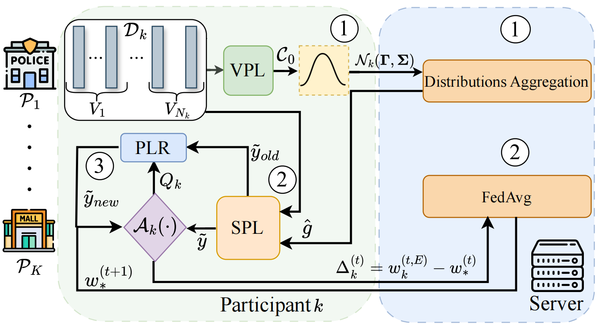

# Anomaly-Detection

## 📌 Papers List

| No.  | Figure  | Title | Pub. | Links |
|------|:------:|:------|:------:|:------|
| 1 |  | **Collaborative Learning of Anomalies with Privacy (CLAP) for Unsupervised Video Anomaly Detection: A New Baseline** | CVPR 2024 | [📄 Paper](https://openaccess.thecvf.com/content/CVPR2024/papers/Al-lahham_Collaborative_Learning_of_Anomalies_with_Privacy_CLAP_for_Unsupervised_Video_CVPR_2024_paper.pdf) |
